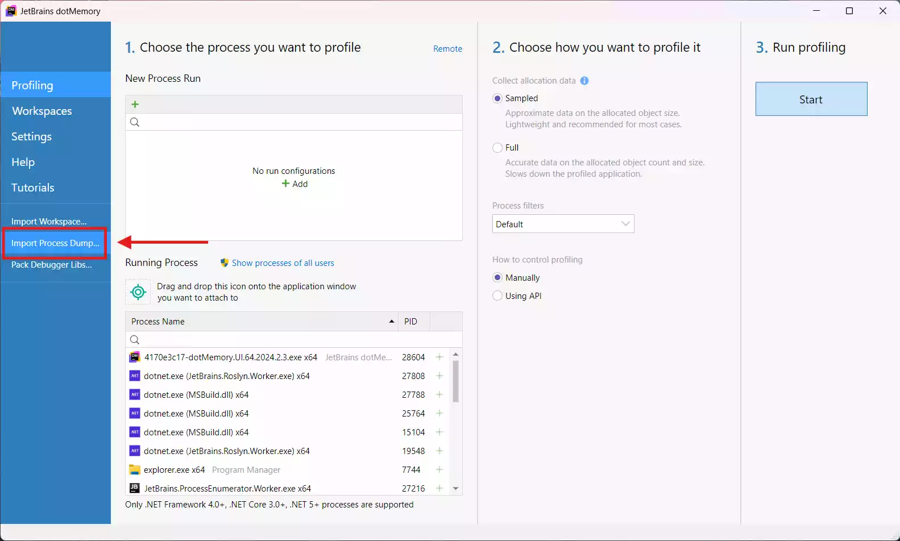
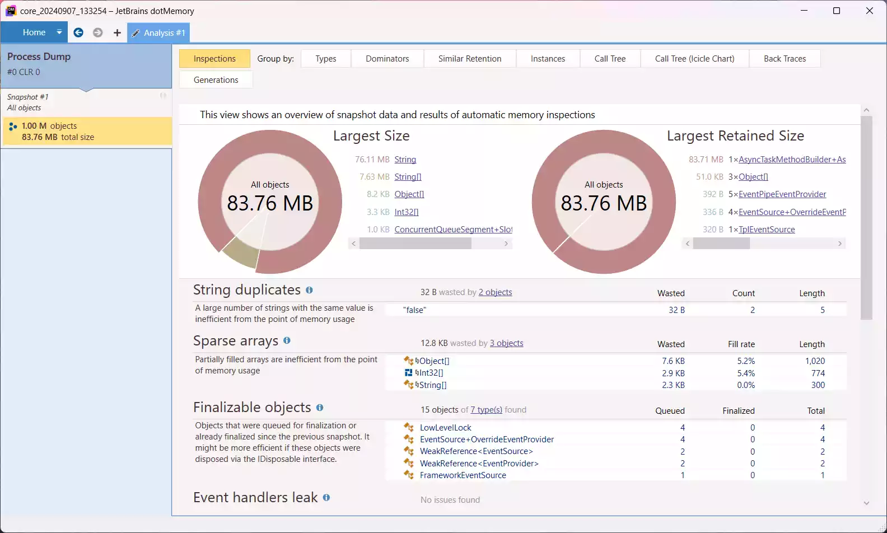
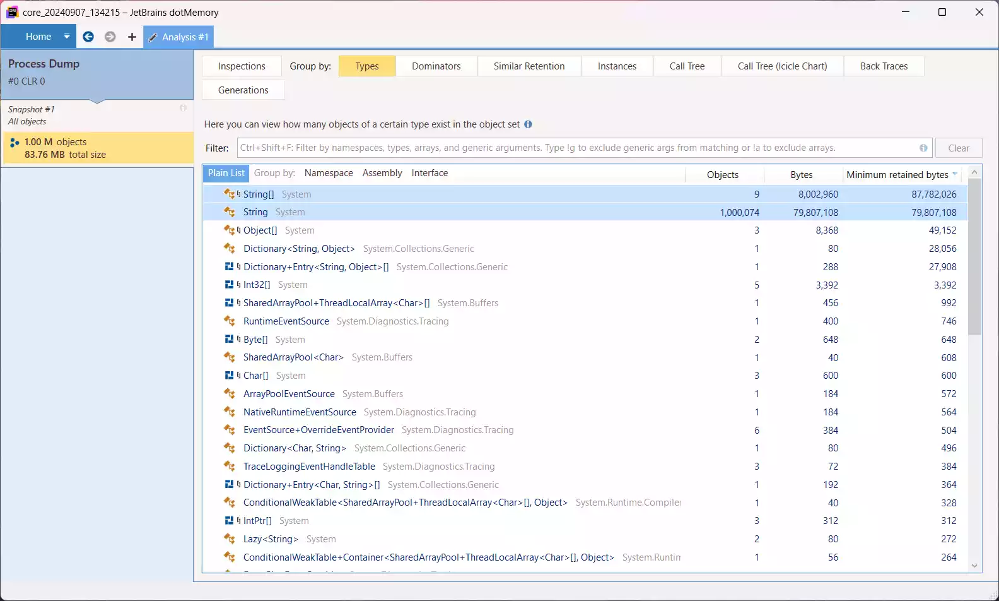
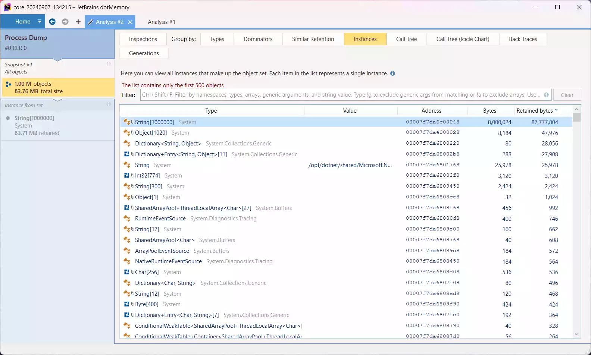
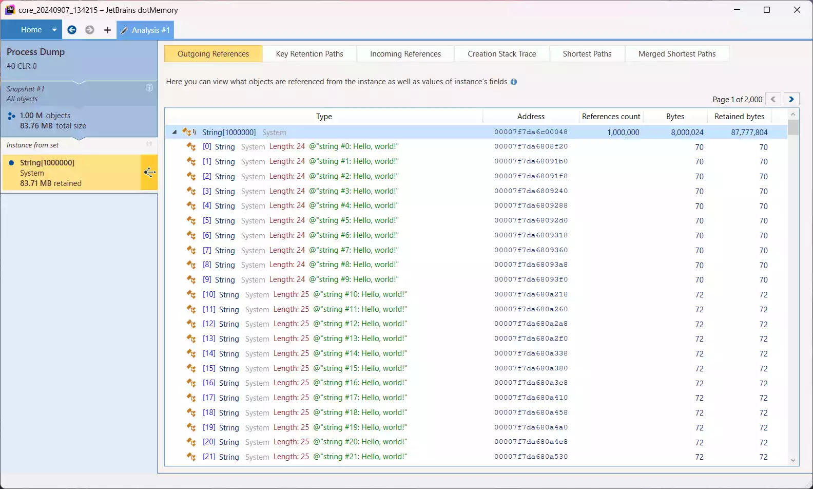

有时候因为内存泄漏、占用不符合预期等等各种各样的原因，我们需要对一个程序的内存进行分析。市面上已经有许多类似的工具，例如本文介绍的 [dotMemory](https://www.jetbrains.com/dotmemory/)、[Visual Studio 自带的 .NET 诊断分析器](https://learn.microsoft.com/zh-cn/visualstudio/debugger/how-to-debug-managed-memory-dump)等等。同时 .NET 作为一个托管运行时，可以直观地看到具体每个对象的占用、内容等信息，更加简化了我们的分析工作。

## 准备工作

首先安装 dotMemory，本文使用的版本为当前最新的 2024.2。

如果只是分析本机上运行的 .NET 程序，那么一个 dotMemory 就可以了，在首页的 **Profiling** 选项卡可以直接选择一个 .NET 进程进行实时分析。但大部分时候我们都是发现一个线上程序出现内存问题而进行分析，这时候就需要对这个程序的内存打“快照”，再传回本地并导入分析工具中。

本文就假设需要分析一个 Linux 服务器上的程序。大致有两种方案可以打快照：

- [`dotnet-dump`](https://learn.microsoft.com/zh-cn/dotnet/core/diagnostics/dotnet-dump)
  - 非常轻量，只有不到 4 MB 的单个可执行文件
  - 生成为相对标准的快照格式
  - 生成的快照文件较大
- [dotMemory 命令行工具](https://www.jetbrains.com/help/dotmemory/Working_with_dotMemory_Command-Line_Profiler.html)
  - 体积较大（~70 MB），部署相对麻烦一点
  - 生成为 dotMemory 专属工作区文件（`.dmw`），和 dotMemory 集成更好
  - 生成的快照文件较小

这里就演示 `dotnet-dump` 的操作。

### 使用 .NET SDK 安装 `dotnet-dump`

如果服务器上有安装 .NET SDK 并有网络权限，可以直接使用以下命令安装 `dotnet-dump` 工具：

```shell
dotnet tool install --global dotnet-dump
```

### 直接下载 `dotnet-dump` 二进制文件

大部分人应该还是不会在服务器上放一个 SDK 吧，这时候就可以手动下载 `dotnet-dump` 的二进制文件，下载链接可以查看[官方文档](https://learn.microsoft.com/zh-cn/dotnet/core/diagnostics/dotnet-dump#install)。

::: warning Alpine 用户
Alpine Linux 需要下载 musl-x64 或 musl-Arm64 版本。
:::

下载好的 `dotnet-dump` 文件复制到服务器的 PATH 目录里，比如 `/usr/bin`。

### 示例程序

作为示例，我们就分析这样一个程序：

```csharp
/* MemoryDemo.dll */

var array = Enumerable.Range(0, 1000000)
    .Select(i => $"string #{i}: Hello, world!")
    .ToArray();

// 保持进程运行
Thread.Sleep(Timeout.Infinite);

// 确保 array 不被 GC 掉
Console.WriteLine(array.Length);
```

## 创建快照

由于我们是模拟一个线上正在运行的程序，这里先把程序跑起来：

```shell
dotnet MemoryDemo.dll
```

查看这个程序的 PID：

```shell
ps -a | grep dotnet
```

例如我这里 PID 为 11064，然后就可以打快照了：

```shell
dotnet-dump collect -p 11064
```

快照文件会存储在当前目录下，文件名格式为 `core_{DATE}_{TIME}`，没有后缀。

## 分析快照

把这个快照文件传输到本地，打开 dotMemory，在主页左侧找到 **Import Process Dump...**，选择刚刚的快照文件，进度条走完即可打开分析页面：





可以看到页面上方有一个 **Group by** 选项，可以以各种方式分类查看内存中的对象。这里举两个通常情况下比较有用的。

### Group by: Types



可以看到每个类型的实例数量、总大小，还可以根据命名空间、程序集等进行进一步分类

### Group by: Instances



可以看到每个具体实例的信息，比如这里就出现了程序中 1000000 长度的字符串数组；进一步点进去还可以看到实例的值：



其他功能可以自行探索。

## 罕见问题：Unable to import the dump

某些极端情况下可能会碰到这种问题：


我的情况是：在 WSL 的 Arch Linux 安装了 Arch 官方源里的 `dotnet-sdk` 包，在看 `dotnet --info` 时注意到 RID 是 `arch-x64`，而不是常规的 `linux-x64`。不确定是不是这个问题，但重新下载了一个官方发布的 .NET SDK 就正常了,可以作为参考。
