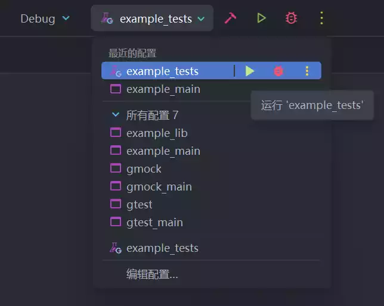

编写单元测试一直是保证代码可靠性的最有效方式。对于 .NET / C#，常用的单元测试框架有 xUnit、NUnit、MSTest 等；而对于 C++，最常见的单元测试框架便是来自 Google 的 GoogleTest，即 gtest。

本文将简要介绍如何将 GoogleTest 添加到项目中，并编写简单的单元测试。

## 创建项目

这里直接用 CLion 创建好了一个空项目，并稍作整理。得到的目录结构如下：

```
example/
  ├─ src/
  │  └─ main.cpp
  ├─ tests/
  ├─ third_party/
  └─ CMakeLists.txt
```

其中，`src` 目录用于存放项目源代码，`third_party` 用于稍后存放 GoogleTest 的源码。

初始的 CMakeLists.txt 内容如下：

```cmake
cmake_minimum_required(VERSION 3.26)
project(example)

set(CMAKE_CXX_STANDARD 17)

add_executable(example src/main.cpp)
```

## 在项目中添加 GoogleTest

### 获取源码

**方法一：直接下载源码**

前往 [Releases 页面](https://github.com/google/googletest/releases) 下载最新版本的 Source Code (zip)，并解压到 `third_party/googletest` 目录下。

**方法二：Git Clone**

在项目根目录执行：

```shell
git clone https://github.com/google/googletest.git third_party/googletest
```

**方法三：Git Submodule**

如果项目已经使用了 Git，也可以使用 Submodule 的方式：

```shell
git submodule add https://github.com/google/googletest.git
```

### 修改 CMakeLists.txt

```cmake
cmake_minimum_required(VERSION 3.26)
project(example)

set(CMAKE_CXX_STANDARD 17)

# 获取源码文件列表，并存储在变量里// [!code ++]
file(GLOB_RECURSE SRC_LIST src/*.cpp)// [!code ++]
file(GLOB_RECURSE TEST_SRC_LIST tests/*.cpp)// [!code ++]
 // [!code ++]
# 默认可执行目标// [!code ++]
add_executable(example_main ${SRC_LIST})// [!code ++]
 // [!code ++]
# 添加 GoogleTest// [!code ++]
add_subdirectory(third_party/googletest)// [!code ++]
include_directories(src third_party/googletest/googletest/include)// [!code ++]
 // [!code ++]
# 由于可执行目标无法链接进另一个可执行目标，这里重新把源码打包成一个静态库目标// [!code ++]
add_library(example_lib ${SRC_LIST})// [!code ++]
# 单元测试目标// [!code ++]
add_executable(example_tests ${TEST_SRC_LIST})// [!code ++]
# 将 gtest_main 和主程序链接进单元测试目标// [!code ++]
# gtest_main 是 GoogleTest 已经为我们写好了的入口，可以自动找到并执行已定义的测试// [!code ++]
# 注意 gtest_main 需要在 example_lib 之前链接，否则 gtest_main 的入口函数会被覆盖// [!code ++]
target_link_libraries(example_tests gtest_main example_lib)// [!code ++]
```

## 编写测试代码

假设我们已经写好了一个需要测试的模块，例如 `src/add.h` 和 `src/add.cpp`：

```cpp
// src/add.h

#ifndef EXAMPLE_ADD_H
#define EXAMPLE_ADD_H

int add(int a, int b);

#endif
```

```cpp
// src/add.cpp

#include "add.h"

int add(int a, int b)
{
    return a + b;
}
```

在 `tests` 目录下新建一个 `add.tests.cpp`（名称随意），并编写基本的测试代码：

```cpp
// tests/add.tests.cpp

#include "gtest/gtest.h"
#include "add.h"

TEST(test_add, will_pass)
{
    // 期望 add(1, 2) 返回的结果等于 3
    EXPECT_EQ(3, add(1, 2));
}

TEST(test_add, will_fail)
{
    // 演示目的，这里出错了
    EXPECT_TRUE(add(4, 5) == 10);
}
```

其中：

- `TEST` 宏指定了一个测试集合，其第一个参数指定测试集合的名称，第二个参数指定单项测试名称。
- `EXPECT_XXX` 宏指定具体的测试项目，符合条件则通过，不符合则失败。

## 执行测试

### 使用命令行

直接指定 `example_tests` 目标，编译并运行即可：

```shell
cmake -B build . && cmake --build build --target example_tests
./build/example_test
```

输出以下结果

```
Running main() from /home/bs/example/third_party/googletest/googletest/src/gtest_main.cc
[==========] Running 2 tests from 1 test suite.
[----------] Global test environment set-up.
[----------] 2 tests from test_add
[ RUN      ] test_add.will_pass
[       OK ] test_add.will_pass (0 ms)
[ RUN      ] test_add.will_fail
/home/bs/example/tests/add.tests.cpp:13: Failure
Value of: add(4, 5) == 10
  Actual: false
Expected: true

[  FAILED  ] test_add.will_fail (0 ms)
[----------] 2 tests from test_add (0 ms total)

[----------] Global test environment tear-down
[==========] 2 tests from 1 test suite ran. (0 ms total)
[  PASSED  ] 1 test.
[  FAILED  ] 1 test, listed below:
[  FAILED  ] test_add.will_fail

 1 FAILED TEST
```

可以看到有一个测试失败了。在错误信息中可以看到失败的文件和行号，以及预期值和实际值。

### 使用 IDE

::: note
这里使用 CLion 示范，其他 IDE 可自行寻找
:::

上方工具栏选择 `example_tests` 目标，直接运行即可。



运行后下方会出现测试结果：


