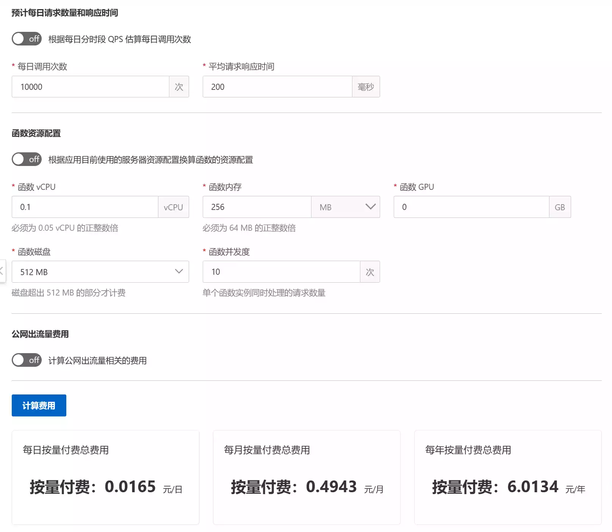
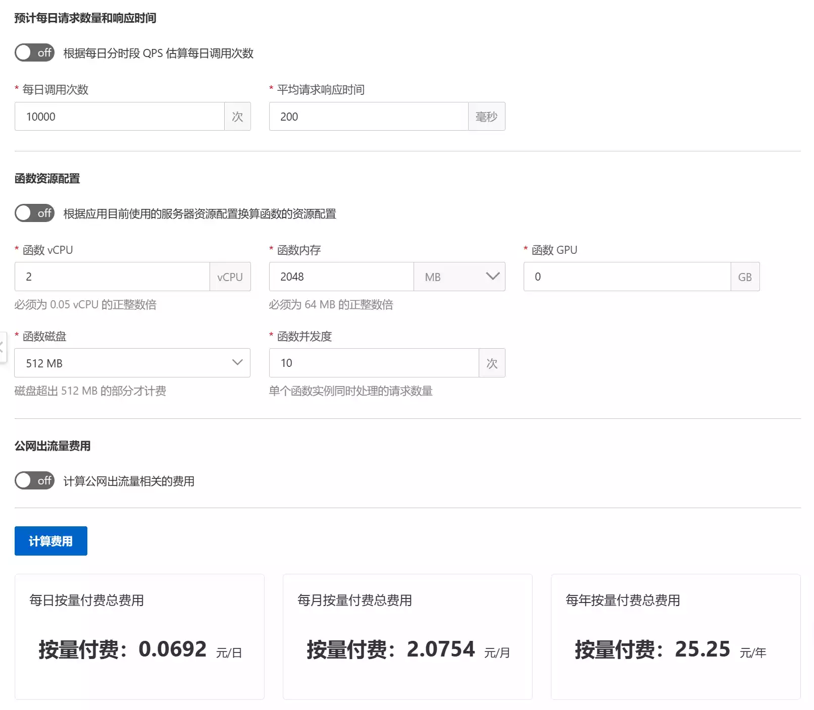
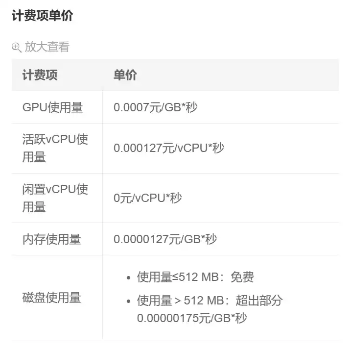
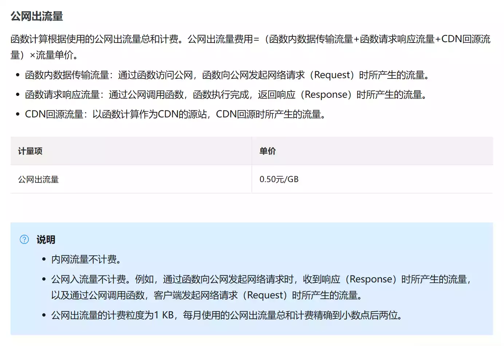
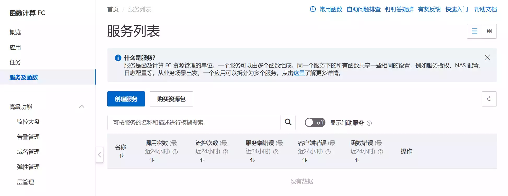

## 简单介绍 Serverless

Serverless 是前几年提出的一种新的云服务架构，迅速得到了业界的广泛关注和使用。对于用户来说，直接能够体验到的就是各大云计算厂商的云函数产品，例如阿里云函数计算，腾讯云云函数，Azure
Functions，AWS Lambda 等等。

对于一个不需要持续进行后台任务的接口服务（例如 REST API，gRPC 等），Serverless 相比传统的云服务器部署拥有许多得天独厚的优势：

- 运维成本低：传统的云服务器需要使用者对运维有一定的了解，并且在服务器选型/购买、环境配置、资源分配等方面都需要亲力亲为。Serverless
  则不同，所有实例的创建销毁都由云服务提供方自动管理，使用者只需要指定资源需求，上传可执行文件/代码，就能直接把服务跑起来。（所谓 "
  Serverless"，就是让用户感知不到配置服务器的步骤）
- 使用成本低：传统的云服务器是按时间收费，比如几个月、一年一次付清，其间如果没有在跑服务，或者使用频率比较低，那时间就白白浪费了。而
  Serverless 服务是按需计费的，只有在接受请求的时候会按调用次数计费，没有请求的时候服务实例会被释放，不会产生费用。
- 利于解耦：Serverless 比微服务还要更进一步，可以把服务拆成更细的粒度，从而在更新时只需要进行小范围的迭代，而不用整个应用都重新部署一遍。
- 弹性扩容：不比云服务器需要在一开始考虑好配置问题，Serverless 服务的资源可以看成是无限的 ——
  由于是根据调用动态创建实例，就可以随时随地根据业务规模去动态调整配置需求。

以阿里云为例，我们看一下一个云函数的使用成本：



0.1 vCPU（虚拟核）+ 256MB 内存，每天调用 10000 次，日消耗只有 **0.0165** 元，一年也只有 **6.0134** 元。



2C2G，每天调用 10000 次，日消耗 **0.0692** 元，年消耗 **25.25** 元。

对于一个接口服务来说，这可比云服务器便宜太多了，就算是轻量应用服务器也是远远不及。

可以前往[官方文档](https://help.aliyun.com/document_detail/54301.html)查看详细的计费组成。以下是写作时（2023.05.07）的计费价目表，仅供参考：





跃跃欲试起来了，接下来看看怎么将一个实际的 ASP.NET Core 应用部署上去。

## 准备

你需要：

- 一个阿里云账号
- 一块钱（够用挺久了.jpg 而且新用户貌似有三个月的试用）
- .NET SDK

## 创建项目

因为是演示，所以就用一个最小应用做示例了，但更大规模的也同样适用。

新创建一个 ASP.NET Core 项目：

```shell
$ dotnet new webapi -o TestAliyunFC
```

打开项目，删去除 `TestAliyunFC.csproj` 和 `Program.cs` 外的其他文件，把 `Program.cs` 改成这个样子：

```csharp
var builder = WebApplication.CreateBuilder(args);

var app = builder.Build();

app.MapGet("/", () => new
{
    Code = 0,
    Message = "Hello, Serverless!"
});

app.Run();
```

运行项目，用 PowerShell 本地测试一下：

```powershell
PS > (Invoke-WebRequest http://localhost:5000).Content
{"code":0,"message":"Hello, Serverless!"}
```

接着发布项目：

```powershell
# 在项目根目录
PS > dotnet publish -c Release
# ...
TestAliyunFC -> C:\Users\bsdayo\Code\TestAliyunFC\TestAliyunFC\bin\Release\net8.0\publish\
```

复制好输出的 dll 等文件，放在一旁备用。

## 准备 ASP.NET Core 运行时

阿里云官方提供的 .NET 环境少得可怜，只有 .NET Core 2.1，.NET Core 3.1 和 .NET 6 三个版本，难以满足我们的需求。好在阿里云提供了
Custom Runtime 和“层”功能，我们可以上传自己的运行时，从而支持各种各样的自定义环境。

前往 [.NET 下载页](https://dotnet.microsoft.com/zh-cn/download/dotnet)，选择自己想要的 .NET 版本。下文将用 .NET 8 Preview
3 举例。


由于我们是需要运行应用，所以下载”ASP.NET Core 运行时“就可以了。系统选择 Linux，在二进制文件一栏找到 x64
架构下载。下载下来是一个 `.tar.gz` 压缩包，我们可以使用 7-Zip 等软件将其解压，也放在一旁备用。

## 创建层

::: question 什么是层？
层是云函数的一个特殊概念，实际上就是运行环境。

> 层可以为您提供公共依赖库、运行时环境及函数扩展等发布与部署能力。您可以将函数依赖的公共库提炼到层或者使用函数计算官方公共层，以减少部署或更新函数时的代码包体积。
>
> [官方文档](https://help.aliyun.com/document_detail/193057.html)

如果云函数的运行环境不带我们需要的运行时，那怎么跑程序呢？只能自己把运行时和代码一起打包了。但是这样做有一点问题：笨重且麻烦。为了解决这个问题，就抽象出了”层“的概念，用于单独打包项目的依赖部分，供多个云函数共享使用。

例如，我们要扔进去的运行时就是一个”层“；Node.js 项目的 node_modules 文件夹也可以当作一个”层“...只要是能多个项目通用的依赖部分，就可以放在”层“里面。
:::

前往[阿里云函数计算控制台](https://fcnext.console.aliyun.com/)并登录，先前没有开通过可能需要走个过场。在左边侧边栏的高级功能里找到层管理点进去：


::: warning 切换区域
默认选择的服务地区是中国大陆，如果后续需要绑定自己的自定义域名，但域名没有备案，那么是无法绑定成功的。在界面顶端切换成香港或者其他大陆以外的地区就没有这个问题。


:::

点击”创建层“，输入基本信息，兼容运行时选上 Linux，层上传方式选择**文件夹上传**，再选择**直接包含 `dotnet` 文件的文件夹**。

::: danger 不要通过 zip 包上传！
如果这里手动把运行时压缩成一个 zip 包再上传，后面就会出现”没有可执行权限“的问题：


这是因为 zip 在压缩的时候不会保留 Linux 的权限信息，导致挂载解压后 `dotnet` 文件的可执行权限丢失。通过文件夹上传就没有这个问题。
:::

::: note 关于路径
自定义层在挂载的时候会自动把所有文件解压到 `/opt` 目录下，因此需要注意路径问题。向上面选择直接包含 `dotnet`
文件的文件夹，挂在后 `dotnet` 文件的路径就是 `/opt/dotnet`。
:::

完成后如下，点创建就行。


## 创建函数服务

在左边的侧边栏找到”服务及函数“，点击”创建服务“按钮，输入服务名称继续。



在接下来的页面中点击”创建函数“。


函数创建页面有几个注意点：

- 创建函数方式选择**使用自定义运行时创建**。
- 基本设置中请求处理程序类型选择**处理 HTTP 请求**。
- 函数代码中，运行环境选择 Linux，代码上传方式任选，启动命令填写：
    ```shell
    /opt/dotnet TestAliyunFC.dll
    ```

  ::: note 关于路径
  上传的代码同样需要注意路径问题，上传的文件夹或 zip 包**内**的代码会存放在 `/code`
  目录下，函数启动时的初始目录也是 `/code`。
  :::

  ::: warning 坑：应用监听地址
  跑在云函数上的应用**必须监听 `0.0.0.0` 地址**，且**应用和函数的监听端口需要保持一致**。为了达成这个要求，我们需要给
  ASP.NET Core 显式设置一下，否则会导致请求超时。

  有两种方法，选择其一即可，这里举例将端口设置为 1145。

    - 在启动命令后面加上 `--urls http://0.0.0.0:1145`
    - 在 `Program.cs` 中加上以下代码，并重新发布上传：
        ```csharp
        builder.WebHost.UseUrls("http://0.0.0.0:1145");
        ```

  然后将”监听端口“项也设置为 1145。
  :::
- 高级配置中可以选择实例规格，按需求选就好，后续可以更改。
- 剩下的环境变量等可以自行配置。

创建完成后会自动打开函数详情页，里面有一个基于 VSCode 的在线编辑器，不过我们只有一堆 dll，只能看着发呆没啥用。

如果对目录结构还是不太清楚，可以开一个内置的终端自己探索一下。需要注意的是层只有在运行的时候才会挂载进来，所以即便稍后添加了自定义层，`/opt`
目录底下也是找不到我们的运行时的。

在编辑器上方找到”编辑层“，点进去


删掉默认带的那个层，再点击添加层-添加自定义层，选好我们刚刚创建的层。这里因为我之前创建过几次，所以版本是 4，不影响。


然后就可以点击左边的”测试函数“了。如果上述的操作都没有问题，你应该能看到这些：


::: success 成功了！
如果你看一眼执行摘要，会发现第一次测试用时相对较长，第二次及之后就只有短短的几毫秒。这是因为云函数在首次请求时会冷启动实例，需要一定时间；而之后就可以直接复用这个实例了。

如果几分钟内没有任何请求，该实例会被自动销毁，下一次请求到来时将重新冷启动实例。
:::

## 外网访问

不能外网访问那接口就没啥意义了。打开“触发器管理（URL）”标签页，里面 defaultTrigger 的信息就是我们的公网地址了。


我们可以直接测试一下“公网访问地址”项：

```powershell
PS > (Invoke-WebRequest https://testaliyunfc-xxxxx.cn-hongkong.fcapp.run).Content
{"code":0,"message":"Hello, Serverless!"}
```

发现也是可以成功访问的。

## 使用自定义域名

默认给的域名太长了不好记，我有个自己的域名（例如 sorabs.cc），想搞成 `testapi.sorabs.cc` 的形式，怎么做呢？

回到函数计算控制台首页，左侧侧边栏高级设置找到域名管理，然后添加自定义域名：


域名框里填写要解析的域名，复制公网 CNAME 后面的值，然后去你的域名服务商添加 DNS 记录，类型设为 CNAME，目标设为复制的值。

例如我的域名在 Cloudflare 上托管：


然后填写下面的路由配置，路径填写 `/*`，其余选择刚刚新建的函数，点击创建。

::: tip 创建失败
添加 DNS 记录需要一定时间，如果没有检测到可以等一会。
:::

最后测试一下（注意是 http://）：

```powershell
PS > (Invoke-WebRequest http://testapi.sorabs.cc).Content
{"code":0,"message":"Hello, Serverless!"}
```

大功告成！

## 后续

可能会注意到在[创建函数服务](#创建函数服务)一节中，请求处理程序类型还可以选择“处理事件请求”，可以进行一些其他的触发操作，比如定时执行等等。计划在之后（咕）写一篇介绍这个的，但是今天摸了）
