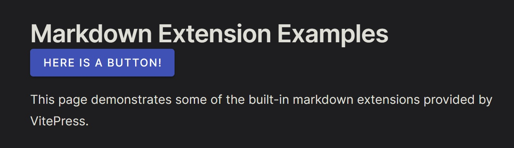

## 创建一个 VitePress 项目

我们先来创建一个新的 VitePress 项目作为演示。如果你需要在已有项目中使用 Vuetify，可以直接跳到下一节。

```shell
$ mkdir vitepress-vuetify
$ cd vitepress-vuetify
$ pnpm add -D vitepress
```

::: note 关于包管理器
这里我使用了 pnpm 作为项目的包管理器。你可以根据自己的习惯替换成 npm 或
yarn，具体可参见[官方文档](https://vitepress.dev/guide/getting-started)。
:::

使用 [Setup Wizard](https://vitepress.dev/guide/getting-started#setup-wizard) 初始化项目：

```shell
$ pnpm exec vitepress init

  vitepress v1.0.0-alpha.75

┌   Welcome to VitePress!
│
◇  Where should VitePress initialize the config?
│  ./
│
◇  Site title:
│  VitePress with Vuetify
│
◇  Site description:
│  A VitePress Site
│
◇  Theme:
│  Default Theme + Customization
│
◇  Use TypeScript for config and theme files?
│  Yes
│
◇  Add VitePress npm scripts to package.json?
│  Yes
│
└  Done! Now run npm run docs:dev and start writing.

Tips:
- Since you've chosen to customize the theme, you should also explicitly install vue as a dev dependency.
```

根据上面的提示，我们需要手动安装 `vue` 作为项目的 `devDependency` 依赖：

```shell
$ pnpm add -D vue
```

接着打开项目中 `.vitepress/theme/index.ts`，发现里面长这样：

```typescript
// https://vitepress.dev/guide/custom-theme
import { h } from 'vue'
import Theme from 'vitepress/theme'
import './style.css'

export default {
  ...Theme,
  Layout: () => {
    return h(Theme.Layout, null, {
      // https://vitepress.dev/guide/extending-default-theme#layout-slots
    })
  },
  enhanceApp({ app, router, siteData }) {
    // ...
  }
}
```

其中 `enhanceApp` 函数就是我们的目标，参数解构出来的 `app`、`router` 分别就是 VitePress 使用的 Vue、Vue Router
实例，我们可以在上面加入自己的修改。

## 将 Vuetify 安装到项目中

安装 Vuetify 以及图标包：

```shell
$ pnpm add -D vuetify @mdi/font
```

在 `.vitepress/theme/index.ts` 旁边新建一个 `vuetify.ts`，用于存放 Vuetify 相关的配置。这里我直接从 Vuetify
脚手架里扒出来一个默认的配置文件，如下所示：

```typescript
import { createVuetify } from 'vuetify'

import 'vuetify/styles'
import '@mdi/font/css/materialdesignicons.css'

export default createVuetify({
  theme: {
    themes: {
      light: {
        colors: {
          primary: '#1867C0',
          secondary: '#5CBBF6',
        },
      },
    },
  },
})
```

接着将 Vuetify 实例接入 Vue App：

```typescript
import vuetify from './vuetify'

export default {
  // ...
  enhanceApp({ app }) {
    app.use(vuetify)
  }
}
```

看上去不错，我们随便在一个 Markdown 文件添加一个 Vuetify 组件看看：

```markdown
# Markdown Extension Examples

<v-btn color="indigo">Here is a button!</v-btn> // [!code ++]

This page demonstrates some of the built-in markdown extensions provided by VitePress.
```

开启 dev 服务器，打开 [http://localhost:5173/markdown-examples.html](http://localhost:5173/markdown-examples.html) 瞅一瞅，


什么都没有，怎么会是呢？

打开 DevTools 的控制台，会发现有这么一段警告：


提示找不到 `v-btn` 这个组件。这是因为我们虽然添加了 Vuetify 作为 Vue 插件，但是实际上一个组件都没有注册进来，自然就找不到了。

回到 `.vitepress/theme/vuetify.ts`，加入以下内容：

```typescript
import { createVuetify } from 'vuetify'
import * as components from 'vuetify/components' // [!code ++]

export default createVuetify({
  components, // [!code ++]
  theme: {
    // ...
  },
})
```

再次回到预览页面，发现已经正确渲染成功了：



## 打包出错

我们假设你现在已经用丰富的 Vuetify 组件做出了许多精美的效果...是时候该打包发布了。

```
$ pnpm run docs:build

  vitepress v1.0.0-alpha.75

✓ building client + server bundles...
build error:
TypeError [ERR_UNKNOWN_FILE_EXTENSION]: Unknown file extension ".css" for C:\Users\bsdayo\Code\vitepress-vuetify\node_modules\.pnpm\vuetify@3.2.1_vue@3.2.47\node_modules\vuetify\lib\components\VCode\VCode.css
    at new NodeError (node:internal/errors:399:5)
    at Object.getFileProtocolModuleFormat [as file:] (node:internal/modules/esm/get_format:99:9)
    at defaultGetFormat (node:internal/modules/esm/get_format:139:38)
    at defaultLoad (node:internal/modules/esm/load:83:20)
    at nextLoad (node:internal/modules/esm/hooks:654:28)
    at Hooks.load (node:internal/modules/esm/hooks:445:26)
    at ESMLoader.load (node:internal/modules/esm/loader:337:38)
    at ESMLoader.moduleProvider (node:internal/modules/esm/loader:207:22)
    at new ModuleJob (node:internal/modules/esm/module_job:63:26)
    at #createModuleJob (node:internal/modules/esm/loader:231:17)
 ELIFECYCLE  Command failed with exit code 1.
```

¿

参考[这个 Issue](https://github.com/vuetifyjs/vuetify/issues/15700)，这是由于在 SSR 构建中，需要针对 Vuetify
进行特殊配置，才能使其正常工作。

打开 `.vitepress/config.ts`，在底下加入这一项：

```typescript
export default defineConfig({
  // ...
  vite: {
    ssr: {
      noExternal: ['vuetify'],
    },
  }
})
```

重新执行命令，这一次可以成功打包了。

打包完了！本地预览一遍看看效果：

```shell
$ pnpm run docs:preview
```

一看，嗯？怎么一堆组件渲染错误？

打开 DevTools 发现只有一行不明所以的报错：

```
Hydration completed but contains mismatches.
```

这个问题其实是指，客户端渲染出来的 HTML 结构和服务器发送的不匹配，通常在一些不能使用 SSR 渲染的动态组件上发生。

没加 Vuetify 啥事没有，加了就出问题，那肯定就出在 Vuetify
上。[查阅文档](https://vuetifyjs.com/en/getting-started/installation/#ssr)可以发现，在 SSR 构建中，需要给 Vuetify 配置这样一句：

```typescript
export default createVuetify({
  // 这一行指示 Vuetify 采用兼容 SSR 的方式进行渲染
  ssr: true, // [!code ++]
  // ...
})
```

再次测试就可以正常渲染了。

## 参考

以下提供了一些文件的完整内容作为参考。

`.vitepress/config.ts`

```typescript
import { defineConfig } from 'vitepress'

// https://vitepress.dev/reference/site-config
export default defineConfig({
  title: "VitePress with Vuetify",
  description: "A VitePress Site",
  vite: {
    ssr: {
      noExternal: ['vuetify'],
    },
  }
})
```

`.vitepress/theme/vuetify.ts`

```typescript
import { createVuetify } from 'vuetify'
import * as components from 'vuetify/components'

import 'vuetify/styles'
import '@mdi/font/css/materialdesignicons.css'

export default createVuetify({
  ssr: true,
  components,
  theme: {
    themes: {
      light: {
        colors: {
          primary: '#1867C0',
          secondary: '#5CBBF6',
        },
      },
    },
  },
})
```

`.vitepress/theme/index.ts`

```typescript
// https://vitepress.dev/guide/custom-theme
import { h } from 'vue'
import Theme from 'vitepress/theme'
import './style.css'
import vuetify from './vuetify'

export default {
  ...Theme,
  Layout: () => {
    return h(Theme.Layout, null, {
      // https://vitepress.dev/guide/extending-default-theme#layout-slots
    })
  },
  enhanceApp({ app }) {
    app.use(vuetify)
  }
}
```
