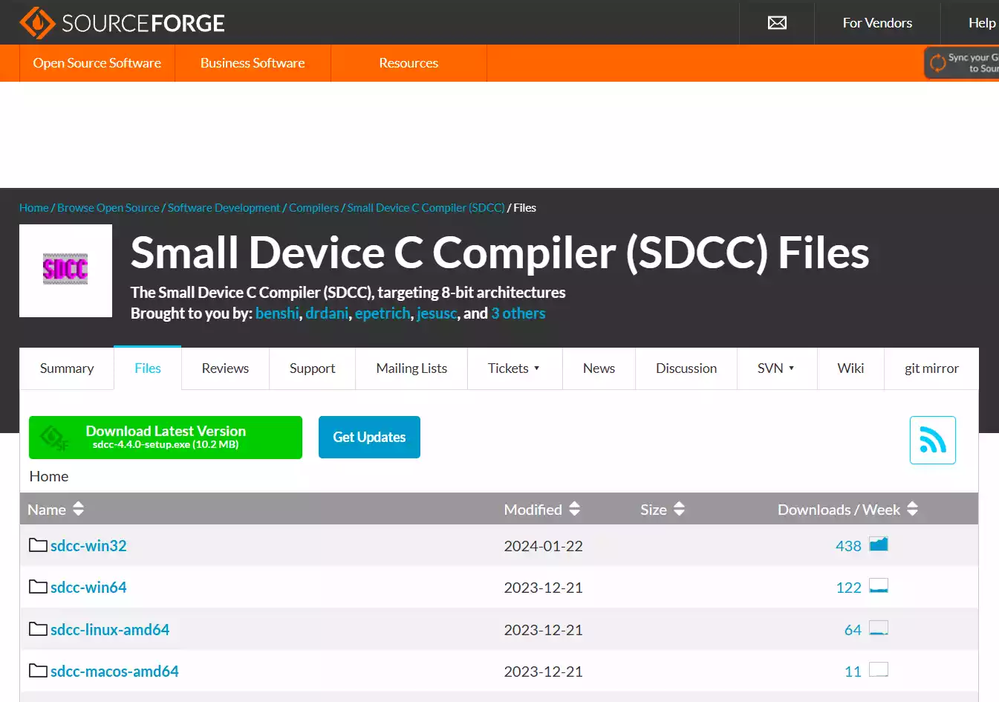
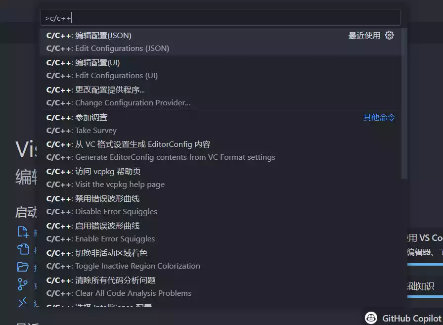

## 前言

最近学校有单片机的专业课，内容是用 Keil µVision 4 开发 51 单片机。作为长时间使用现代化开发工具的开发者，古老软件 Keil 的体验实在是太无法忍受了：没有代码补全、极少代码高亮、只有编译才能看到错误，甚至连缩进和括号的补全都没有。于是自行探索了一下 Keil 之外给 51 单片机开发程序的做法，体验直线上升，就写了这篇文章记录一下。

## 配置环境

### SDCC

51 单片机都有数十年的历史了，自然不可能只有 Keil 为其提供了编译器之类的工具链。开源的 SDCC（Small Device C Compiler）就是完美的替代品，使用 CLI 提供功能，方便进行各种个性化的集成。

SDCC 是专为 8-bit 单片机开发的 C 编译器，以 GPL 协议[在 SourceForge 上开源](https://sdcc.sourceforge.net/)。可以前往下载页面下载安装程序：



下载后执行安装程序，就可以调用 `sdcc` 等命令了。

### VSCode

VS Code 的下载安装就不赘述了，还是贴一个官网链接吧：[code.visualstudio.com](https://code.visualstudio.com/)

VSCode 中需要安装基础的 [C/C++ 扩展](https://marketplace.visualstudio.com/items?itemName=ms-vscode.cpptools)。

用 VSCode 打开一个新的文件夹，使用 `Ctrl+Shift+P` 打开命令窗口，搜索到“编辑配置（JSON）”并打开：



随后会自动生成 `.vscode/c_cpp_properties.json` 文件，把里面直接清空并替换为以下内容：

```jsonc
{
  "configurations": [
    {
      "name": "SDCC",
      // 在 SDCC 安装目录底下找 bin\sdcc.exe，并把路径复制在这里，记得转义斜杠
      "compilerPath": "C:\\Program Files\\SDCC\\bin\\sdcc.exe",
      "defines": ["LINT"]
    }
  ],
  "version": 4
}
```

到此环境配置就结束了，接下来上手写点代码。

## 开发

这里以一个 LED 闪烁的例子展示：

```c
// 以下部分是为了让 VSCode 的代码分析正常工作
// 也可以写成单独的头文件
// https://github.com/microsoft/vscode-cpptools/issues/2499
// https://github.com/microsoft/vscode-cpptools/issues/7146
#ifdef LINT
#undef __SDCC_mcs51
#include <stdbool.h>
#include <lint.h>
#endif

// 导入头文件（8052.h，不同于 Keil 的 regx52.h）
#include <8052.h>

#include <stdint.h>

#define LED_PIN P2_0

uint16_t timer_0_interruption_times = 0;

void reset_timer_0(void)
{
    // 1 ms 中断一次
    TH0 = (65536 - 1000) / 256;
    TL0 = (65536 - 1000) % 256;
}

void handle_timer_0(void) __interrupt(1)
{
    timer_0_interruption_times++;
    if (timer_0_interruption_times == 500)
    {
        // 500 ms 触发一次
        LED_PIN = !LED_PIN;
        timer_0_interruption_times = 0;
    }

    reset_timer_0();
}

void main(void)
{
    // 初始化 Timer 0
    TMOD |= 0x01;
    reset_timer_0();
    ET0 = 1;
    EA = 1;
    TR0 = 1;

    while (1)
        ;
}
```

上面的代码有几点需要注意的地方：

- VSCode 实际上并没有官方支持 SDCC（即便这样也还是吊打 Keil），所以要自己做一点 hack 来修代码提示（最上面的部分）
- 使用 `8052.h`，而不是 `regx52.h` 等等
- 没法再 `sbit XXX = PX_X` 了，可以直接用宏：`#define XXX PX_X`
- 定义中断的格式为 `__interrupt(x)`，不同于 Keil 的 `interrupt x`

随后可以编译并打包为 `.hex` 文件：

```shell
# 编译源码，生成同名 .ihx 文件
sdcc main.c

# 将 .ihx 转换为烧录用的 .hex 文件
packihx main.ihx > main.hex
```

然后打开烧录工具（例如 STCAI-ISP），把 `.hex` 烧录进去就完成了，步骤没错会看到接在 P2_0 上的 LED 每秒闪烁一次。